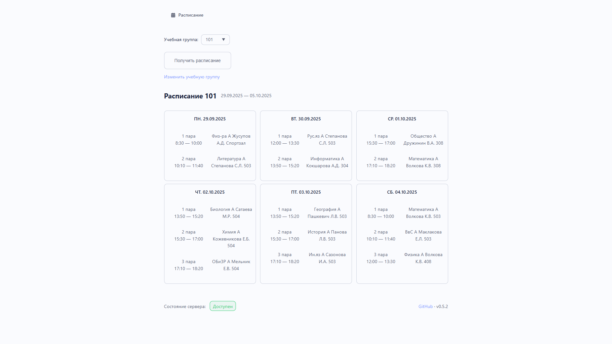

# Preco Web App

PrecoApp - Application that allows you to get schedule of the Ural Regional College group. This web application is a direct evolution of [telegram-bot-parser](https://github.com/levalyukov/telegram-bot-parser).

This application is a learning exercise. Consequently, some implementation choices may reflect that learning process rather than production-grade best practices. It's my first project combining React, TypeScript, and various libraries



## TODO

- [X] Parser through Playwright
- [X] Getting schedules for other groups
- [ ] Getting a weekly schedule for groups

## Main modules

- Core: [React](https://github.com/facebook/react) + [TypeScript](https://github.com/microsoft/TypeScript)
- Server: [Express.js](https://github.com/expressjs/express)
- Parser: [Playwright](https://github.com/microsoft/playwright)
- Icons: [Font Awesome](https://github.com/FortAwesome/Font-Awesome)
- Build: [Vite](https://github.com/vitejs/vite)

## Install

```bash
git clone https://github.com/levalyukov/preco-app.git
cd preco-app
npm run dev -- --host
```

Start server:
```bash
cd src/server
node server.js
```

## License
This repo is licensed by [MIT](license).
